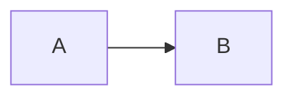
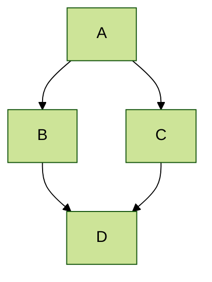



## 关键文件/目录的位置

* 基本配置选项：_config.yml
* 顶部导航栏配置：_data/navigation.yml
* 单页：_pages/
* 页面集合是以下目录中的 .md 或 .html 文件：
  * _publications/
  * _portfolio/
  * _posts/
  * _teaching/
  * _talks/
* 页脚：_includes/footer.html
* 静态文件（如 PDF）：/files/
* 个人资料图片（可在 _config.yml 中设置）：images/profile.png

## 提示和技巧

* 将文件命名为 ".md" 以使用 markdown 渲染，命名为 ".html" 以使用 HTML 渲染。
* 转到 [提交列表](https://github.com/academicpages/academicpages.github.io/commits/master)（在您的仓库中）查找 GitHub 使用 Jekyll 构建的最后一个版本。
  * 绿色勾选：构建成功
  * 橙色圆圈：正在构建
  * 红色 X：错误
  * 无图标：未构建

* Academic Pages 使用 [Jekyll Kramdown](https://jekyllrb.com/docs/configuration/markdown/)，GitHub Flavored Markdown (GFM) 解析器，它与 GitHub 上使用的 Markdown 版本类似，但可能有一些细微差异。
  * GitHub 支持的一些表情符号应该通过 [Jemoji](https://github.com/jekyll/jemoji) 插件支持 :computer:。
  * 支持的表情符号的最佳列表可以在 [通过 Jemoji 为 Jekyll 提供的表情符号](https://www.fabriziomusacchio.com/blog/2021-08-16-emojis_for_Jekyll/#computer) 博客文章中找到。

* 虽然 GitHub Pages 阻止服务器端代码运行，但支持客户端脚本。
  * 这意味着支持 Google Analytics，[wiki](https://github.com/academicpages/academicpages.github.io/wiki/Adding-Google-Analytics) 应该包含使其工作的最新信息。

* 您的简历可以使用 Markdown（[预览](https://academicpages.github.io/cv/)）编写，也可以通过 JSON（[预览](https://academicpages.github.io/cv-json/)）生成，布局略有不同。您可以在 `_data/navigation.yml` 中更新正在使用的路径，默认情况下 JSON 格式的 CV 是隐藏的。

* [Liquid 语法指南](https://shopify.github.io/liquid/tags/control-flow/) 对于想要向模板添加功能或成为 [GitHub 上的模板](https://github.com/academicpages/academicpages.github.io) 贡献者的人很有用。

## MathJax

模板包含对 MathJax（版本 3.*，通过 [jsDelivr](https://www.jsdelivr.com/)，[文档](https://docs.mathjax.org/en/latest/)）的支持：

$$
\displaylines{
\nabla \cdot E= \frac{\rho}{\epsilon_0} \\\
\nabla \cdot B=0 \\\
\nabla \times E= -\partial_tB \\\
\nabla \times B  = \mu_0 \left(J + \varepsilon_0 \partial_t E \right)
}
$$

默认分隔符 `$$...$$` 和 `\\[...\\]` 支持显示的数学，而 `\\(...\\)` 应用于行内数学（例如，\\(a^2 + b^2 = c^2\\)）

**注意**，由于 Academic Pages 使用 Markdown，这会对 MathJax 和 LaTeX 的转义字符和换行造成一些干扰，尽管 [存在一些解决方法](https://math.codidact.com/posts/278763/278772#answer-278772)。在某些情况下，例如当您在论文的 `citation` 字段中包含 MathJax 时，可能需要使用 `\(...\)` 进行行内分隔。

## Mermaid 图表

Academic Pages 包含对 [Mermaid 图表](https://mermaid.js.org/)（版本 11.*，通过 [jsDelivr](https://www.jsdelivr.com/)）的支持，除了他们的 [教程](https://mermaid.js.org/ecosystem/tutorials.html) 和 [GitHub 文档](https://github.com/mermaid-js/mermaid) 之外，基本语法如下：

```markdown
    ```mermaid
    graph LR
    A-->B
    ```
```

使用 [默认主题](https://mermaid.js.org/config/theming.html) 应用时会产生以下图表：



而应用 `forest` 主题的更高级图表如下所示：



## Plotly

Academic Pages 通过 Markdown 代码元素中的钩子包含对 Plotly 图表的支持，尽管熟悉 HTML 和 JavaScript 的人也可以 [通过这些路由](https://plotly.com/javascript/getting-started/) 访问它。Plotly 通过 `npm` [包](https://www.npmjs.com/package/plotly.js?activeTab=readme) 包含，并作为模板最小化 JavaScript 的一部分分发。

为了通过 Markdown 渲染 Plotly 图表，需要按如下方式添加相关图表数据：

```markdown
    ```plotly
    {
      "data": [
        {
          "x": [1, 2, 3, 4],
          "y": [10, 15, 13, 17],
          "type": "scatter"
        },
        {
          "x": [1, 2, 3, 4],
          "y": [16, 5, 11, 9],
          "type": "scatter"
        }
      ]
    }
    ```
```

**重要！** 由于数据被解析为 JSON，*所有*键都需要加引号才能渲染图表。强烈建议使用 [JSONLint](https://jsonlint.com/) 等工具检查语法。
{: .notice}

这将产生以下结果：
```plotly
{
  "data": [
    {
      "x": [1, 2, 3, 4],
      "y": [10, 15, 13, 17],
      "type": "scatter"
    },
    {
      "x": [1, 2, 3, 4],
      "y": [16, 5, 11, 9],
      "type": "scatter"
    }
  ]
}
```

本质上发生的是 [Plotly 属性](https://plotly.com/javascript/reference/index/) 从代码块中作为 JSON 数据提取，解析，并传递给 Plotly，同时传递与当前站点主题匹配的主题（即浅色主题或深色主题）。这允许所有可以通过 `data` 属性描述的图表在图表主题的一些限制下渲染。

```plotly
{
  "data": [
    {
      "x": [1, 2, 3, 4, 5],
      "y": [1, 6, 3, 6, 1],
      "mode": "markers",
      "type": "scatter",
      "name": "团队 A",
      "text": ["A-1", "A-2", "A-3", "A-4", "A-5"],
      "marker": { "size": 12 }
    },
    {
      "x": [1.5, 2.5, 3.5, 4.5, 5.5],
      "y": [4, 1, 7, 1, 4],
      "mode": "markers",
      "type": "scatter",
      "name": "团队 B",
      "text": ["B-a", "B-b", "B-c", "B-d", "B-e"],
      "marker": { "size": 12 }
    }    
  ],
  "layout": {
    "xaxis": {
      "range": [ 0.75, 5.25 ]
    },
    "yaxis": {
      "range": [0, 8]
    },
    "title": {"text": "数据标签悬停"}
  }
}
```

```plotly
{
  "data": [{
      "x": [1, 2, 3],
      "y": [4, 5, 6],
      "type": "scatter"
    },
    {
      "x": [20, 30, 40],
      "y": [50, 60, 70],
      "xaxis": "x2",
      "yaxis": "y2",
      "type": "scatter"
  }],
  "layout": {
    "grid": {
      "rows": 1,
      "columns": 2,
      "pattern": "independent"
    },
    "title": {
      "text": "简单子图"
    }    
  }
}
```

```plotly
{
  "data": [{
		"z": [[10, 10.625, 12.5, 15.625, 20],
          [5.625, 6.25, 8.125, 11.25, 15.625],
          [2.5, 3.125, 5.0, 8.125, 12.5],
          [0.625, 1.25, 3.125, 6.25, 10.625],
          [0, 0.625, 2.5, 5.625, 10]],
		"type": "contour"
	}],
  "layout": {
    "title": {
      "text": "基本等高线图"
    }
  }
}
```

## Markdown 指南

Academic Pages 使用 [kramdown](https://kramdown.gettalong.org/index.html) 进行 Markdown 渲染，它与其他 Markdown 实现（如 GitHub 的）有一些差异。除了本指南外，请参阅 [kramdown 语法页面](https://kramdown.gettalong.org/syntax.html) 获取完整文档。

### 三级标题

#### 四级标题

##### 五级标题

###### 六级标题

## 引用块

单行引用：

> 引用很酷。

## 表格

### 表格 1

| 条目            | 项目   |                                                              |
| --------         | ------ | ------------------------------------------------------------ |
| [张三](#)    | 2016   | 列表中项目的描述                          |
| [李四](#)    | 2019   | 列表中项目的描述                          |
| [王五](#)     | 2022   | 列表中项目的描述                          |

### 表格 2

| 标题1 | 标题2 | 标题3 |
|:--------|:-------:|--------:|
| 单元格1   | 单元格2   | 单元格3   |
| 单元格4   | 单元格5   | 单元格6   |
|-----------------------------|
| 单元格1   | 单元格2   | 单元格3   |
| 单元格4   | 单元格5   | 单元格6   |
|=============================|
| 页脚1   | 页脚2   | 页脚3   |

## 定义列表

定义列表标题
:   定义列表分区。

初创公司
:   初创公司或 startup 是一家公司或临时组织，旨在寻找可重复和可扩展的商业模式。

#dowork
:   由 Rob Dyrdek 和他的私人保镖 Christopher "Big Black" Boykins 创造，"Do Work" 作为自我激励者，激励您的朋友。

现场执行
:   我会让 Bill O'Reilly [解释](https://www.youtube.com/watch?v=O_HyZ5aW76c "We'll Do It Live") 这个。

## 无序列表（嵌套）

  * 列表项一 
      * 列表项一 
          * 列表项一
          * 列表项二
          * 列表项三
          * 列表项四
      * 列表项二
      * 列表项三
      * 列表项四
  * 列表项二
  * 列表项三
  * 列表项四

## 有序列表（嵌套）

  1. 列表项一 
      1. 列表项一 
          1. 列表项一
          2. 列表项二
          3. 列表项三
          4. 列表项四
      2. 列表项二
      3. 列表项三
      4. 列表项四
  2. 列表项二
  3. 列表项三
  4. 列表项四

## 按钮

应用 `.btn` 类可以使任何链接更加突出。

## 通知

使用以下语法支持基本通知或标注：

```markdown
**注意！** 您还可以通过在段落后的行附加 `{: .notice}` 来添加通知。
{: .notice}
```

这将渲染为：

**注意！** 您还可以通过在段落后的行附加 `{: .notice}` 来添加通知。
{: .notice}

### 脚注

脚注对于澄清文本中的要点或引用信息很有用。[^1] Markdown 支持数字脚注，以及文本，只要值是唯一的。[^note]

```markdown
这是常规文本。[^1] 这是更多常规文本。[^note]

[^1]: 这是脚注本身。
[^note]: 这是另一个脚注。
```

[^1]: 例如这个脚注。
[^note]: 使用文本作为脚注标记时，名称中不允许有空格。

## HTML 标签

### 地址标签

<address>
  1 Infinite Loop<br /> Cupertino, CA 95014<br /> United States
</address>

### 锚标签（即链接）

这是一个 [链接](https://github.com "GitHub") 的示例。

### 缩写标签

缩写 CSS 代表"Cascading Style Sheets"（层叠样式表）。

*[CSS]: Cascading Style Sheets

### 引用标签

"代码就是诗歌。" ---<cite>Automattic</cite>

### 代码标签

您将在这些测试中了解到 `word-wrap: break-word;` 将是您最好的朋友。

您还可以编写更大的代码块，支持某些语言的语法高亮，例如 Python：

```python
print('Hello World!')
```

或 R：

```R
print("Hello World!", quote = FALSE)
```

### 详情标签（可折叠部分）

HTML `<details>` 标签与 Markdown 配合良好，允许您包含可折叠部分，有关如何使用该标签的更多信息，请参阅 [W3Schools](https://www.w3schools.com/tags/tag_details.asp)。

<details>
  <summary>默认折叠</summary>
  此部分默认折叠！
</details>

源代码：

```HTML
<details>
  <summary>默认折叠</summary>
  此部分默认折叠！
</details>
```

或者，您可以通过在标签中包含 `open` 属性来默认打开部分：

<details open>
  <summary>默认打开</summary>
  由于 &lt;details open&gt; 标签中的 open，此部分默认打开！
</details>


### 强调标签

强调标签应该 _斜体化_ 文本。

### 插入标签

此标签应表示 <ins>插入的</ins> 文本。

### 键盘标签

这个鲜为人知的标签模拟 <kbd>键盘文本</kbd>，通常样式类似于 `<code>` 标签。

### 预格式化标签

此标签样式化大块代码。

<pre>
.post-title {
  margin: 0 0 5px;
  font-weight: bold;
  font-size: 38px;
  line-height: 1.2;
  这是一行非常、非常、非常、非常长的文本，只是为了看看 PRE 标签如何处理它并找出它如何溢出；
}
</pre>

### 引用标签

<q>开发者，开发者，开发者&#8230;</q> &#8211;Steve Ballmer

### 删除标签

此标签将让您 <strike>删除文本</strike>。

### 粗体标签

此标签显示 **粗体文本**。

### 下标标签

使用 H<sub>2</sub>O 进行科学样式设置，这应该将"2"向下推。

### 上标标签

仍然坚持科学和 Isaac Newton 的 E = MC<sup>2</sup>，这应该将 2 向上提升。

### 变量标签

这允许您表示 <var>变量</var>。

***
**脚注**

页面中的脚注将在此行之后返回，返回到 <a href="#footnotes">Markdown 脚注</a> 部分。
